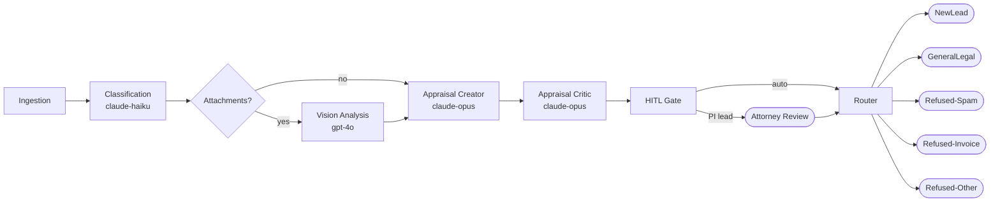

# lex-triage-agent

> **Production-grade legal email triage** — a multimodal LangGraph agent pipeline that ingests inbound email, classifies it across five legal categories, analyses photo attachments with GPT-4o vision, drafts a legal appraisal, stress-tests it with an adversarial critic, and routes confirmed *personal-injury leads* through attorney Human-in-the-Loop review — all with full LangSmith telemetry and a regression-gated evaluation harness.

Built on the governance model from [`wojciechkrukar/agentic-workforce-kernel`](https://github.com/wojciechkrukar/agentic-workforce-kernel).

---

## What this solves

A personal-injury law firm drowns in inbound email — spam, invoices, general enquiries — with real accident leads buried inside. Missed leads are lost revenue. False positives waste attorney time. This pipeline automates the triage step end-to-end:

- Classifies every email in < 30 s with Claude Haiku
- Analyses attached accident photos with GPT-4o vision
- Drafts a 200-word legal appraisal with Claude Opus, then adversarially scores it
- Gates every PI lead on attorney approval before CRM intake
- Tracks Precision / Recall / latency / cost per run and blocks merges on KPI regression

Zero API keys needed to run — the full pipeline works offline with deterministic stubs.

---

## Architecture



Seven LangGraph nodes. Each is a pure function that reads `TriageState` and returns only the keys it modifies. The HITL interrupt is first-class: the graph suspends cleanly at the gate, serialises full state, and resumes after the human decision — no nodes re-run.

---

## Stack

| Layer | Technology |
|-------|-----------|
| Orchestration | [LangGraph](https://github.com/langchain-ai/langgraph) `StateGraph` with conditional edges + interrupt |
| LLM providers | Anthropic Claude (text), OpenAI GPT-4o (vision) via LangChain |
| Telemetry | [LangSmith](https://smith.langchain.com/) — every node is a named `@traceable` span |
| Evaluation | Custom harness · Lead Precision / Recall · P50/P90/P95 latency · cost per run |
| Dataset | Synthetic GT-labelled corpus — 12 scenarios, chokepoint data-firewall |
| Notebooks | Plotly dashboard + interactive HITL runner (ipywidgets) |
| Packaging | `uv` workspaces · `pyproject.toml` per app |
| CI | All tests pass on `LLM_TIER=tier3` (no network, deterministic stubs) |

---

## Quickstart

```bash
cp .env.example .env   # optional — stubs work without keys
uv sync
uv run pytest -q       # all green, no API calls

# Generate synthetic dataset + run eval
uv run dataset-generator generate --n 100 --seed 42
LLM_TIER=tier3 uv run legal-triage eval \
    --dataset apps/dataset-generator/out/emails_demo_gt.jsonl \
    --save-baseline

# Open the live notebooks
jupyter lab notebooks/lex_triage_dashboard.ipynb
jupyter lab notebooks/lex_triage_interactive.ipynb
```

For real model calls: set `LLM_TIER=tier1`, `ANTHROPIC_API_KEY`, `OPENAI_API_KEY`.

---

## KPI contract

Enforced by the eval harness — a merge that regresses KPI #1 by > 5 pp is **automatically blocked**.

| # | Metric | Target |
|---|--------|--------|
| 1 | **Lead Precision** | maximise — never regress |
| 2 | **Lead Recall** | maximise — never regress |
| 3 | E2E latency | < 30 s at tier1 |
| 4 | Token cost | optimise after 1–3 are green |

---

## Design highlights

**Creator-critic appraisal pair** — The `appraisal_creator` drafts (Claude Opus, optimised for completeness). The `appraisal_critic` adversarially scores it (0–1). The HITL gate uses the score as a signal: low confidence → mandatory attorney review. Two independent LLM opinions, surfaced as a measurable number.

**Chokepoint data firewall** — Ground-truth labels live only in `RawEmailRecord`. A single `chokepoint.py` module is the only code allowed to read or strip them. Tests enforce this boundary. The triage pipeline is provably blind to how the test data was generated.

**Tier-gated LLM factory** — `llm_factory.py` is the only file that imports provider SDKs. Every node calls `get_llm(role)`. Switching a model is a one-line change in the factory; zero node files change. `LLM_TIER=tier3` swaps every provider for a deterministic in-process stub — the same code path runs in CI and production.

**Durable HITL** — LangGraph's interrupt suspends the graph at a well-defined checkpoint. State is fully serialisable at the pause point, enabling a production deployment to persist the queue to a database and resume days later without re-running earlier nodes.

---

## Repository layout

```
apps/dataset-generator/   Phase 1 — synthetic labelled corpus (12 scenarios)
apps/legal-triage/        Phase 2 — LangGraph inference pipeline + eval harness
notebooks/                Executive dashboard · interactive HITL runner
runtime/benchmarks/       Versioned eval results (JSON)
docs/kernel/              Agent governance (Director protocol, escalation matrix)
```

---

## Documentation

- **[Technical Walkthrough](WALKTHROUGH.md)** — complete end-to-end explanation of every layer
- [Dataset generator](apps/dataset-generator/README.md)
- [Legal triage app](apps/legal-triage/README.md)
- [Kernel governance](docs/kernel/README.md)