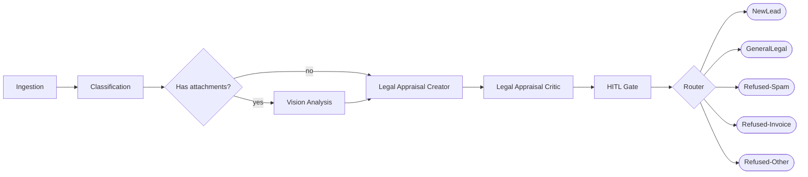

# lex-triage-agent

> **Legal Email Triage** — a LangChain/LangGraph multimodal agentic system that ingests inbound email, classifies it, and surfaces new *personal-injury / accident leads* for a law firm with HITL review and full LangSmith telemetry.

Built on the governance model from [`wojciechkrukar/agentic-workforce-kernel`](https://github.com/wojciechkrukar/agentic-workforce-kernel). Vendored kernel docs live in [`docs/kernel/`](docs/kernel/).

---

## Two-phase plan

| Phase | App | Purpose |
|-------|-----|---------|
| 1 | `apps/dataset-generator/` | Generate ~100 synthetic emails with hidden ground-truth labels across legal-injury scenarios + distractors |
| 2 | `apps/legal-triage/` | LangGraph triage pipeline: Ingestion → Classification → Vision → Appraisal → HITL → Router |

---

## Quickstart

```bash
cp .env.example .env          # fill in your API keys
uv sync                        # install all workspace deps
uv run pytest -q               # run all tests (all pass with stubs)
```

---

## Triage graph



---

## Documentation

- [Kernel governance docs](docs/kernel/README.md)
- [Copilot instructions](.github/copilot-instructions.md)
- [Agent roles](.github/agents/README.md)
- [Dataset generator](apps/dataset-generator/README.md)
- [Legal triage app](apps/legal-triage/README.md)

---

## KPI priority order

1. **Precision on new PI leads** — false positives waste attorney time; never regress.
2. **Recall on new PI leads** — missed leads = lost revenue.
3. **E2E latency** — target < 30 s per email at tier1.
4. **Token cost** — optimise only after 1–3 are green.

Agentic LangGraph application that triages inbound email, classifies legal-injury / accident leads, and runs multimodal scene analysis on attached photos. Built on the governance model from `wojciechkrukar/agentic-workforce-kernel`.

> Bootstrapping in progress. Full scaffolding (synthetic dataset generator, LangGraph triage app, per-role LLM tier matrix, telemetry, HITL, evaluation harness) is being added in the first PR.