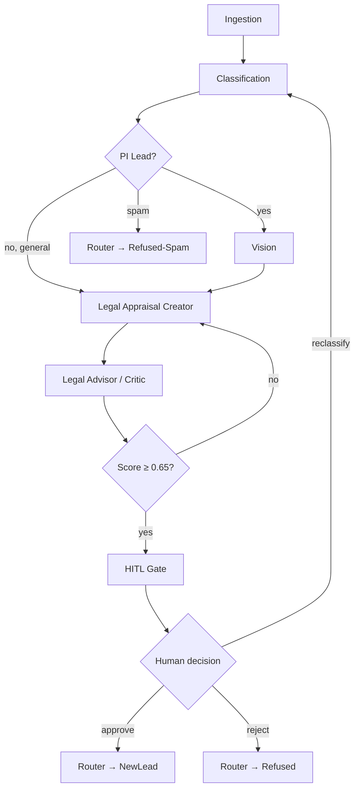

# Architecture

## Graph DAG



## EmailTriageState schema

```python
class EmailTriageState(TypedDict):
    # Input
    email_id: str
    raw_email: str
    attachments: list[dict]          # [{filename, content_type, data_b64}]

    # Classification
    email_class: str | None          # "pi_lead" | "general_legal" | "spam" | "invoice" | "other"
    class_confidence: float | None

    # Vision
    vision_report: dict | None       # VisionReport (see docs/team/task_contracts.md)
    vision_summary: str | None       # human-readable narrative for Legal Appraisal

    # Appraisal
    appraisal_draft: str | None
    appraisal_score: float | None    # 0–1, set by Legal Advisor / Critic
    appraisal_critique: str | None

    # HITL
    hitl_required: bool
    human_decision: str | None       # "approve" | "reject" | "reclassify"
    human_notes: str | None

    # Routing
    terminal_sink: str | None        # "NewLead" | "GeneralLegal" | "Refused-Spam" | "Refused"

    # Telemetry
    total_cost_usd: float
    total_latency_ms: int
    model_calls: list[dict]          # [{node, model, cost_usd, latency_ms}]

    # Errors
    errors: list[str]
```

## Node descriptions

| Node | Role | Model (tier1) |
|------|------|--------------|
| Ingestion | Parse raw email, extract attachments, normalise | — (no LLM) |
| Classification | Classify email into one of 5 classes | Claude Haiku 4.5 |
| Vision | Run multimodal analysis on attachments | GPT-5.5 |
| Legal Appraisal Creator | Draft legal appraisal memo | Claude Opus 4.7 |
| Legal Advisor / Critic | Score and critique appraisal draft | Claude Opus 4.7 |
| HITL Gate | `langgraph.interrupt()` — pause for human input | — |
| Router | Map decision to terminal sink | — (no LLM) |

## Terminal sinks

| Sink | Meaning |
|------|---------|
| `NewLead` | Confirmed PI lead; routed to intake CRM |
| `GeneralLegal` | General legal enquiry; routed to general correspondence queue |
| `Refused-Spam` | Classified as spam; quarantined |
| `Refused` | Rejected by human at HITL gate |
